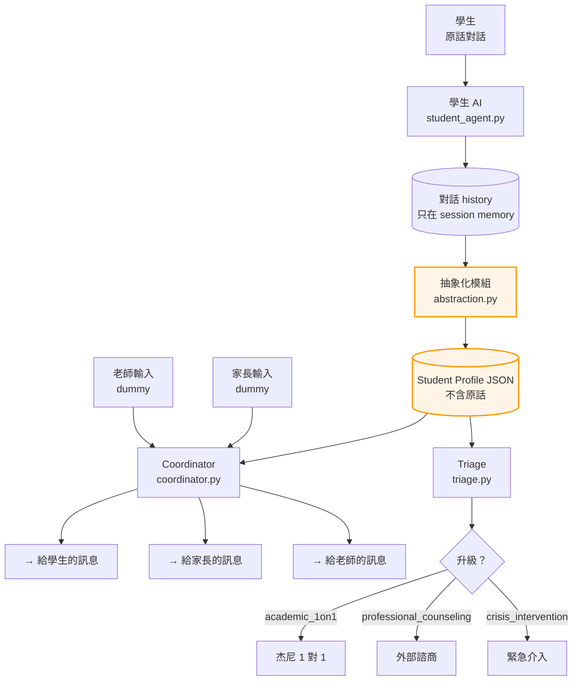

# 三方 AI 教育協調工具 — Phase 1 Lean MVP

> 一個讓 **學生 / 家長 / 老師 / coordinator** 透過 AI 中介、保留隱私牆、可協調而非互推責任的教育對話系統。
>
> 這個 repo 是 **Phase 1 Lean MVP**：只實作學生端 AI + Coordinator，家長/老師端用 dummy data 模擬。

---

## Quick Start

預設用 **Gemini Flash（免費）**——直接拿 key 就能跑，不用花錢。

```bash
git clone <your-repo-url> three-party-ai-mvp
cd three-party-ai-mvp

# 1. 安裝相依套件
python -m venv .venv && source .venv/bin/activate   # 可選但建議
pip install -r requirements.txt

# 2. 拿 Gemini API key（免費）
#    → 去 https://aistudio.google.com/ 登入 → 左側 "Get API key" → Create

# 3. 設定 .env
cp .env.example .env
# 編輯 .env，把 GEMINI_API_KEY 換成上一步拿到的 key

# 4. 跑！
streamlit run app.py
```

開啟瀏覽器到 `http://localhost:8501`。在左邊 sidebar 新建一個學生 → 在「聊天」分頁聊幾句 → 按「更新 Profile」→ 切到其他分頁看 Coordinator 與 Triage 的輸出。

### 想換 Provider？只改一行

這個 repo 用 [LiteLLM](https://docs.litellm.ai/) 當 universal adapter。換 provider 只需要在 `.env` 改 `LLM_MODEL` 一行 + 設對應 key，**不用改任何 Python 程式**。

```bash
# 在 .env 裡
LLM_MODEL=anthropic/claude-sonnet-4-5    # 換到 Claude
ANTHROPIC_API_KEY=sk-ant-...

# 或
LLM_MODEL=ollama/llama3.2                # 本地跑（不用 key）

# 或
LLM_MODEL=deepseek/deepseek-chat         # 中國端便宜選項
DEEPSEEK_API_KEY=...
```

詳細選項看下方「免費 / 便宜的 Provider 選擇」段落。

---

## 這個 MVP 是什麼

四個核心模組，全部由 prompt 驅動（prompt 在 `prompts/` 資料夾，改 prompt 不用改程式）：

| 模組 | 檔案 | 做什麼 |
|---|---|---|
| **學生 AI** | `src/student_agent.py` | 跟學生聊天的傾訴對象。不評判、不說教、邀請繼續講。 |
| **抽象化（隱私牆）** | `src/abstraction.py` | 把對話原話 → 不含原話的 profile JSON。 |
| **Coordinator** | `src/coordinator.py` | 收三方輸入（學生 profile + 家長 dummy + 老師 dummy）→ 產協調方案 + 給三方的訊息。 |
| **Triage** | `src/triage.py` | 判斷是否該升級到杰尼 1 對 1 / 心理諮商 / 緊急介入。 |

### 架構圖



橘色框框就是「隱私牆」——對話原話只活在 session memory，**永遠不寫入磁碟**。寫到磁碟的只有抽象化過的 profile。

---

## 跑測試

```bash
pytest -v                       # 全部
pytest tests/test_privacy.py    # 只跑隱私測試（純邏輯部分不需要 API key）
```

沒設 API key 的測試會自動 skip，不會紅。

跑整個 dataset 的回歸評測：

```bash
python -m scripts.run_dataset_eval > eval_report.md
# 限制只跑前 5 筆（省 API 費）：
EVAL_LIMIT=5 python -m scripts.run_dataset_eval
```

---

## 免費 / 便宜的 Provider 選擇

LiteLLM 支援 100+ provider。下面是開發階段最划算的幾個。在 `.env` 的 `LLM_MODEL` 填對應字串、設對應 key 就好。

### 🟢 Gemini Flash（推薦預設）—— **完全免費**

- 拿 key：<https://aistudio.google.com/> → "Get API key" → Create
- 免費額度：~1500 requests/day
- `.env`：
  ```
  LLM_MODEL=gemini/gemini-2.5-flash
  GEMINI_API_KEY=...
  ```
- 想更聰明（但慢一點）：`gemini/gemini-2.5-pro`

### 🟢 Groq —— **免費 + 超快推論**

- 拿 key：<https://console.groq.com/>
- 免費額度有 rate limit 但夠開發用，推論速度遠快於其他家
- `.env`：
  ```
  LLM_MODEL=groq/llama-3.3-70b-versatile
  GROQ_API_KEY=...
  ```

### 🟡 DeepSeek —— **極便宜（付費但 < $1/M tokens）**

- 拿 key：<https://platform.deepseek.com/>
- 中國端，速度好、品質不錯、價格約 Claude 的 1/20
- `.env`：
  ```
  LLM_MODEL=deepseek/deepseek-chat
  DEEPSEEK_API_KEY=...
  ```

### 🟢 Ollama 本地 —— **完全免費 + 隱私**

最適合在處理敏感資料（青少年對話）時用——資料完全不離開你的電腦。

```bash
# 1. 安裝 Ollama
brew install ollama         # macOS
# 或下載：https://ollama.com/

# 2. 拉模型（推薦先試小的）
ollama pull llama3.2        # 3B，跑得動但較笨
ollama pull qwen2.5:14b     # 14B，中文好，需要 16GB RAM
ollama pull llama3.1:70b    # 70B，最強，需要 64GB RAM

# 3. 確認 server 在跑
ollama serve                # macOS app 會自動背景跑

# 4. 在 .env 設
# LLM_MODEL=ollama/llama3.2   （或你 pull 的模型名）
# 不需要 API key
```

⚠️ 注意：小模型（< 7B）跑這個產品的 JSON 抽象化很容易壞——格式跑掉、欄位漏掉。Ollama 路線建議至少 14B 以上。

### 🔴 Claude / GPT-4o —— **最強但要花錢**

- 真正上 Pilot 時建議用這檔，開發階段過於奢侈
- `.env`：
  ```
  LLM_MODEL=anthropic/claude-sonnet-4-5    # 或 openai/gpt-4o-mini
  ANTHROPIC_API_KEY=sk-ant-...
  ```

### 切 Provider 後該做什麼

1. **重跑 dataset eval**：不同 model 對抽象化 prompt 的遵循程度不一樣，要看 `scripts/run_dataset_eval.py` 的 triage 正確率與隱私洩漏數有沒有變化
2. **看 JSON 格式有沒有崩**：較小的模型容易回不合法 JSON。`src/llm.py` 的 `parse_json_lenient` 有容錯，但極端情況還是會壞
3. **調 prompt**：如果某個 model 一直在某個欄位上失誤，去 `prompts/abstraction.txt` 加 few-shot 範例

---

## 把 synthetic dataset 接進來

把 dataset 任務產出的 JSON 整個內容貼到 `data/synthetic_dataset.json`（覆蓋既有內容）。預期結構：

```json
{
  "personas": [
    { "id": "persona_001", "age": 15, "metadata": {"risk_profile": "low", "tags": ["..."]} }
  ],
  "conversations": [
    {
      "id": "conv_001",
      "persona_id": "persona_001",
      "scenario_type": "normal | privacy_test | stress_test | crisis",
      "should_trigger_triage": false,
      "expected_escalation_type": "none",
      "expected_risk_flags": [],
      "turns": [
        { "role": "user", "content": "..." },
        { "role": "assistant", "content": "..." }
      ]
    }
  ]
}
```

`tests/conftest.py` 與 `scripts/run_dataset_eval.py` 都會自動讀這個檔。

---

## 這個 MVP 還沒做什麼

刻意拿掉，不是忘了：

- 帳號 / 登入系統
- 真正的家長端 / 老師端 UI（現在用 dummy data 模擬）
- 資料庫（用本機 JSON 檔）
- 多學生並行對話的 session 管理
- 對話原話的稽核日誌（隱私牆現在是「不寫入」實現）
- 部署（純本機跑）
- 觀測 / metrics（只有 stdout）
- 多語系（介面文字寫死中文）
- Prompt 注入 / 對抗測試
- LLM 回應的 streaming（現在是 blocking）

---

## 下一階段（Pilot MVP）要加什麼

按優先序：

1. **家長端 + 老師端的 UI**——他們也要有可以講話的介面，不能永遠都是 dummy
2. **帳號 + 多學生資料隔離**（最簡單：file-based + Streamlit-Authenticator；正規做法：FastAPI + Postgres）
3. **Coordinator 自動觸發**——目前是手動按按鈕，未來應該根據 profile 變化 / triage 訊號自動跑
4. **對話結束自動 abstraction**——不用每次手按「更新 Profile」
5. **真正的 escalation 流程**——升級到 crisis_intervention 時要實際通知人（email / SMS / 在後台跳 alert）
6. **Pilot 用戶資料寫 audit log**——所有抽象化決策都要可追溯
7. **前端改 Next.js**（如果要走產品化路線）

---

## 檔案結構

```
three-party-ai-mvp/
├── README.md                   ← 你正在讀的
├── requirements.txt
├── .env.example
├── .gitignore
├── app.py                      ← Streamlit 主程式
├── src/
│   ├── llm.py                  ← Claude API wrapper
│   ├── student_agent.py        ← 學生對話 agent
│   ├── abstraction.py          ← 原話 → Profile JSON
│   ├── coordinator.py          ← 三方輸入合成器
│   ├── triage.py               ← 升級判斷
│   └── profile_store.py        ← JSON 檔讀寫
├── prompts/
│   ├── student_system.txt      ← 學生 AI 的 system prompt
│   ├── abstraction.txt         ← 抽象化 prompt
│   ├── coordinator.txt         ← Coordinator system prompt
│   └── triage.txt              ← Triage 判斷 prompt
├── data/
│   ├── synthetic_dataset.json  ← 從 dataset 任務複製過來
│   ├── dummy_inputs.json       ← Dummy 家長/老師輸入
│   └── student_profiles/       ← 運行時存 JSON
├── tests/
│   ├── conftest.py
│   ├── test_abstraction.py
│   ├── test_triage.py
│   └── test_privacy.py
└── scripts/
    └── run_dataset_eval.py     ← 跑整個 dataset 的評測
```

---

## 修改 Prompt

**所有 prompt 都在 `prompts/` 資料夾，純文字檔。** 改完直接重新整理 Streamlit 頁面就生效，不需要動 Python 程式。

最常需要調的：

- `student_system.txt` — 學生 AI 的個性與邊界
- `coordinator.txt` — 「學生福祉 > 三方關係 > 商業變現」的權重在這裡
- `triage.txt` — 升級閾值的鬆緊

---

## 隱私牆的承諾

1. **學生原話絕不寫入磁碟**——只活在 session memory，重新整理頁面就消失
2. **Profile JSON 不含原話**——`abstraction.py` 會用 LLM 抽象化，並有 validator 檢查
3. **家長 / 老師端只看到 profile 的子集**——`what_to_share_with_parent` / `what_to_share_with_teacher` 是明確的 view，不會洩漏 `do_not_share` 或 `risk_flags`
4. **`data/student_profiles/*.json` 在 `.gitignore`**——profile 不會意外 commit

`tests/test_privacy.py` 會驗證上述承諾。

---

## Contributing

（待補）

## License

建議用 MIT，由 Alan 決定。
