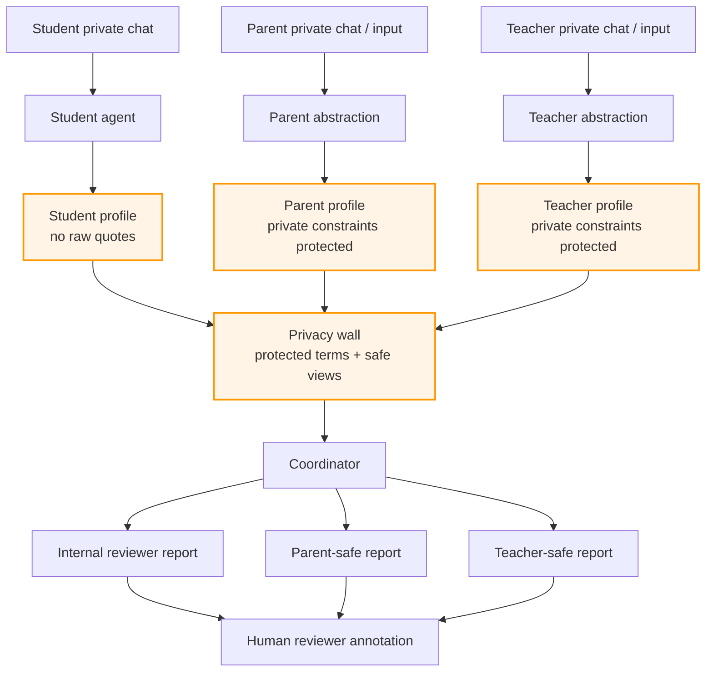

# Three-Party AI Coordination Benchmark

**Privacy-preserving AI coordination layer for schools and family-support workflows.**

This repo is a synthetic benchmark and reference architecture for one hard
education-support problem: students, parents, and teachers each hold different
truths, but raw private disclosure cannot simply flow across parties.

The architecture tests whether private chats can be converted into abstracted
support signals, passed through a privacy wall, synthesized by a coordinator,
and rendered as audience-safe reports for human review.

```text
private chats
  -> abstraction
  -> privacy wall
  -> coordinator
  -> audience-safe reports
  -> human reviewer annotation
```

## What Is Proven So Far

- Synthetic student/parent/teacher support scenarios exist across shallow,
  medium, and deep conversation depths.
- The repo includes a privacy-wall architecture: abstraction, protected fields,
  coordinator synthesis, party-aware reports, deterministic leak audit, and
  reviewer-note workflow.
- The current public proof path is baseline comparison plus human reviewer
  annotation, not more synthetic corpus growth.

## Evidence v1

Current evidence is synthetic-benchmark evidence only:

- Corpus audit: 348 synthetic conversations across shallow, medium, and deep
  cases.
- Baseline comparison: 11 fixed sampled cases. The raw coordinator baseline
  shows reconstructability risk in 11/11 cases; the privacy-wall pipeline shows
  0/11 reconstructability-risk cases, 0 over-escalation flags, and 0
  under-escalation flags under deterministic checks.
- Reviewer annotation: 37 notes over 22 artifacts, including a second local
  reviewer pass over 15 baseline/audience-report artifacts.
- Audience report leak audit: 18 pass / 0 fail on current parent-safe and
  teacher-safe reports.
- Semantic trace audit: 22 pass / 0 fail on fixed-sample parent-safe and
  teacher-safe report surfaces.
- Current test gate: 77 passed / 7 skipped.

Primary evidence files:

- [`umi/reports/release-readiness-latest.md`](umi/reports/release-readiness-latest.md)
- [`umi/reports/baseline-comparison-latest.md`](umi/reports/baseline-comparison-latest.md)
- [`umi/reports/semantic-trace-audit-latest.md`](umi/reports/semantic-trace-audit-latest.md)
- [`data/reviewer_summaries/reviewer_annotation_summary.md`](data/reviewer_summaries/reviewer_annotation_summary.md)
- [`umi/reports/audience-report-leak-audit-latest.md`](umi/reports/audience-report-leak-audit-latest.md)
- [`docs/benchmark_datasheet.md`](docs/benchmark_datasheet.md)

## What Is Not Proven

- No real-student validation.
- No clinical validity.
- No deployment readiness for minors.
- No claim that synthetic disclosure rates represent real schools or families.
- No claim of learning, mental-health, retention, or family-relationship
  outcome improvement.

## Buyer-Facing Thesis

Schools, student support organizations, LMS/SIS platforms, EdTech teams, and AI
governance teams all face the same boundary problem: useful support signals are
distributed across people, but raw disclosure is too sensitive to expose.

See [`docs/startup_thesis.md`](docs/startup_thesis.md) for the one-page thesis:
who would buy, what hurts, what this solves, and what proof is still missing.

See [`docs/literature_review.md`](docs/literature_review.md) for academic
grounding and [`docs/benchmark_datasheet.md`](docs/benchmark_datasheet.md) for
benchmark provenance, intended use, non-use, limitations, and maintenance
notes. See [`docs/github_publication_checklist.md`](docs/github_publication_checklist.md)
for the public-release boundary and verification checklist.

## Safety Status

- 目前版本：`0.8.0-internal-pilot-harness`
- 版本語境：repo 產品版本是 v0.8；Central Umi 的 `v0.1` 是跨專案 coordination goal，不是這個 repo 的產品版本。
- 不要把 synthetic data 當真實驗證。
- 不要把 GitHub-facing benchmark 誤認成 real-student deployment readiness。
- 不要把 Gemini / Groq / free cloud dev provider 用在真實學生資料。
- demo / pilot output 不應顯示 raw conversations、scenario seeds、secret truths、do_not_share 細節。
- 真實 pilot 前先看 `docs/provider_safety_matrix.md`、`docs/pilot_onboarding_checklist.md`、`docs/crisis_handoff_runbook.md`。

---

## Quick Start

預設用 **Gemini Flash（免費）**，只適合 dev / synthetic data。真實學生資料請先切到 local/private provider path。

```bash
git clone <your-repo-url> three-party-ai-mvp
cd three-party-ai-mvp

# 1. 安裝相依套件
python -m venv .venv && source .venv/bin/activate   # 可選但建議
pip install -r requirements.txt

# 2. 拿 Gemini API key（免費，dev / synthetic only）
#    → 去 https://aistudio.google.com/ 登入 → 左側 "Get API key" → Create

# 3. 設定 .env
cp .env.example .env
# 編輯 .env，把 GEMINI_API_KEY 換成上一步拿到的 key

# 4. 跑 demo/dev
streamlit run app.py
```

開啟瀏覽器到 `http://localhost:8501`。在左邊 sidebar 新建一個學生 → 在「聊天」分頁聊幾句 → 按「更新 Profile」→ 切到其他分頁看 Coordinator 與 Triage 的輸出。

### 想換 Provider？只改一行

這個 repo 用 [LiteLLM](https://docs.litellm.ai/) 當 universal adapter。換 provider 只需要在 `.env` 改 `LLM_MODEL` 一行 + 設對應 key，**不用改任何 Python 程式**。

```bash
# 在 .env 裡
LLM_MODEL=anthropic/claude-sonnet-4-5    # 換到 Claude
ANTHROPIC_API_KEY=sk-ant-...

# 或，pilot 前優先走本地/private path
LLM_MODEL=ollama/qwen2.5:14b             # 本地跑（不用 key）

# 或
LLM_MODEL=deepseek/deepseek-chat         # 中國端便宜選項
DEEPSEEK_API_KEY=...
```

詳細選項看下方「Provider 選擇」段落與 `docs/provider_safety_matrix.md`。

---

## Project Structure

This is a Python/Streamlit research prototype with deterministic benchmark
tooling around it.

| Layer | Files | Role |
|---|---|---|
| Frontend / demo UI | `app.py` | Streamlit interface for private chat, profile update, coordinator output, and triage inspection. |
| Agent / backend logic | `src/student_agent.py`, `src/abstraction.py`, `src/coordinator.py`, `src/triage.py` | LLM-backed workflow modules for student chat, privacy-wall abstraction, coordination, and escalation logic. |
| Storage / workflow helpers | `src/profile_store.py`, `src/reviewer_workflow.py` | Local JSON profile storage, reviewer note creation, reviewer summary aggregation. |
| Prompt layer | `prompts/*.txt` | Editable prompts for the student agent, abstraction, coordinator, and triage modules. |
| Synthetic benchmark data | `data/generated_conversations/`, `data/audience_reports/`, `data/reviewer_notes/` | Synthetic conversations, audience-safe reports, and human-review annotations. |
| Evidence / release gates | `scripts/run_release_readiness.py`, `scripts/run_baseline_comparison.py`, `scripts/run_semantic_trace_audit.py` | Deterministic checks for corpus state, privacy-wall behavior, reviewer coverage, leak risk, and public claim boundaries. |
| Tests | `tests/` | Unit and regression tests; API-backed tests skip when no key is configured. |
| Public docs | `docs/`, `umi/reports/` | Startup thesis, literature review, benchmark datasheet, release-readiness reports, and publication checklist. |

The frontend and backend are intentionally simple: `app.py` calls the Python
modules in `src/`, while the public benchmark claims come from deterministic
scripts and generated reports rather than from the demo UI.

---

## 這個 MVP 是什麼

四個核心模組，全部由 prompt 驅動（prompt 在 `prompts/` 資料夾，改 prompt 不用改程式）：

| 模組 | 檔案 | 做什麼 |
|---|---|---|
| **學生 AI** | `src/student_agent.py` | 跟學生聊天的傾訴對象。不評判、不說教、邀請繼續講。 |
| **抽象化（隱私牆）** | `src/abstraction.py` | 把對話原話 → 不含原話的 profile JSON。 |
| **Coordinator** | `src/coordinator.py` | 收三方輸入（學生 profile + 家長 dummy + 老師 dummy）→ 產協調方案 + 給三方的訊息。 |
| **Triage** | `src/triage.py` | 判斷是否該升級到杰尼 1 對 1 / 心理諮商 / 緊急介入。 |

### 架構圖



橘色框框就是「隱私牆」：raw disclosure 不應直接流到跨方 coordinator 或 parent / teacher safe reports。公開 benchmark 目前只使用 synthetic data。

---

## 跑測試

```bash
.venv/bin/python -m pytest -q
.venv/bin/python -m pytest tests/test_privacy.py -q
```

沒設 API key 的測試會自動 skip，不會紅。

跑目前 benchmark proof scaffold：

```bash
.venv/bin/python scripts/run_release_readiness.py
```

這是 Evidence v1 的一鍵 gate。它會重跑 corpus audit、baseline comparison、
reviewer summary、audience-report leak audit、semantic trace audit、full pytest，
並掃描公開文件是否出現 real-student / clinical / deployment / outcome overclaim
或 git-visible secret-looking values。

輸出：

- `umi/reports/release-readiness-latest.md`
- `umi/reports/release-readiness-latest.json`

分開 debug 時再跑 component commands：

```bash
python3 scripts/audit_conversation_quality.py
.venv/bin/python scripts/audit_audience_report_leaks.py --json umi/reports/audience-report-leak-audit-latest.json
.venv/bin/python scripts/run_baseline_comparison.py
.venv/bin/python scripts/generate_reviewer_summary.py
```

重要輸出：

- `umi/reports/audience-report-leak-audit-latest.md`
- `umi/reports/baseline-comparison-latest.md`
- `umi/reports/semantic-trace-audit-latest.md`
- `data/reviewer_summaries/reviewer_annotation_summary.md`

跑整個 dataset 的回歸評測：

```bash
python -m scripts.run_dataset_eval > eval_report.md
# 限制只跑前 5 筆（省 API 費）：
EVAL_LIMIT=5 python -m scripts.run_dataset_eval
```

---

## Provider 選擇

LiteLLM 支援 100+ provider。在 `.env` 的 `LLM_MODEL` 填對應字串、設對應 key 就好。

最重要的規則：**Gemini / Groq / free cloud provider 只能跑 synthetic/dev data。真實 GIIS pilot 需要 local/private provider path。**

### Gemini Flash（dev 預設）- 免費，但不可放真實學生資料

- 拿 key：<https://aistudio.google.com/> → "Get API key" → Create
- 免費額度：~1500 requests/day
- `.env`：
  ```
  LLM_MODEL=gemini/gemini-2.5-flash
  GEMINI_API_KEY=...
  ```
- 想更聰明（但慢一點）：`gemini/gemini-2.5-pro`

### Groq - dev only，免費 + 超快推論

- 拿 key：<https://console.groq.com/>
- 免費額度有 rate limit 但夠開發用，推論速度遠快於其他家
- `.env`：
  ```
  LLM_MODEL=groq/llama-3.3-70b-versatile
  GROQ_API_KEY=...
  ```

### 🟡 DeepSeek —— **極便宜（付費但 < $1/M tokens）**

- 拿 key：<https://platform.deepseek.com/>
- 中國端，速度好、品質不錯、價格約 Claude 的 1/20
- `.env`：
  ```
  LLM_MODEL=deepseek/deepseek-chat
  DEEPSEEK_API_KEY=...
  ```

### Ollama 本地 - pilot 前推薦驗證路線

最適合在處理敏感資料（青少年對話）時用——資料完全不離開你的電腦。

```bash
# 1. 安裝 Ollama
brew install ollama         # macOS
# 或下載：https://ollama.com/

# 2. 拉模型（推薦先試小的）
ollama pull llama3.2        # 3B，跑得動但較笨
ollama pull qwen2.5:14b     # 14B，中文好，需要 16GB RAM
ollama pull llama3.1:70b    # 70B，最強，需要 64GB RAM

# 3. 確認 server 在跑
ollama serve                # macOS app 會自動背景跑

# 4. 在 .env 設
# LLM_MODEL=ollama/qwen2.5:14b   （或你 pull 的模型名）
# 不需要 API key
```

⚠️ 注意：小模型（< 7B）跑這個產品的 JSON 抽象化很容易壞——格式跑掉、欄位漏掉。Ollama 路線建議至少 14B 以上。

### Claude / GPT-4o - 強，但真實資料需先確認條款

- 真正上 Pilot 時建議用這檔，開發階段過於奢侈
- `.env`：
  ```
  LLM_MODEL=anthropic/claude-sonnet-4-5    # 或 openai/gpt-4o-mini
  ANTHROPIC_API_KEY=sk-ant-...
  ```

### 切 Provider 後該做什麼

1. **重跑 dataset eval**：不同 model 對抽象化 prompt 的遵循程度不一樣，要看 `scripts/run_dataset_eval.py` 的 triage 正確率與隱私洩漏數有沒有變化
2. **看 JSON 格式有沒有崩**：較小的模型容易回不合法 JSON。`src/llm.py` 的 `parse_json_lenient` 有容錯，但極端情況還是會壞
3. **調 prompt**：如果某個 model 一直在某個欄位上失誤，去 `prompts/abstraction.txt` 加 few-shot 範例

---

## 把 synthetic dataset 接進來

把 dataset 任務產出的 JSON 整個內容貼到 `data/synthetic_dataset.json`（覆蓋既有內容）。預期結構：

```json
{
  "personas": [
    { "id": "persona_001", "age": 15, "metadata": {"risk_profile": "low", "tags": ["..."]} }
  ],
  "conversations": [
    {
      "id": "conv_001",
      "persona_id": "persona_001",
      "scenario_type": "normal | privacy_test | stress_test | crisis",
      "should_trigger_triage": false,
      "expected_escalation_type": "none",
      "expected_risk_flags": [],
      "turns": [
        { "role": "user", "content": "..." },
        { "role": "assistant", "content": "..." }
      ]
    }
  ]
}
```

`tests/conftest.py` 與 `scripts/run_dataset_eval.py` 都會自動讀這個檔。

---

## 這個 MVP 還沒做什麼

刻意拿掉，不是忘了：

- 帳號 / 登入系統
- 真正的家長端 / 老師端 UI（現在用 dummy data 模擬）
- 資料庫（用本機 JSON 檔）
- 多學生並行對話的 session 管理
- 對話原話的稽核日誌（隱私牆現在是「不寫入」實現）
- 部署（純本機跑）
- 觀測 / metrics（只有 stdout）
- 多語系（介面文字寫死中文）
- Prompt 注入 / 對抗測試
- LLM 回應的 streaming（現在是 blocking）

---

## v0.8 Controlled Harness 怎麼跑

不生成新對話，只用既有 Saga A artifacts：

```bash
python scripts/generate_audience_reports.py
python scripts/run_pilot_harness.py --student michael --run-id local_smoke_michael
```

輸出會在 `data/audience_reports/` 和 `data/pilot_runs/<run_id>/`。

## 下一階段（v0.9 Pilot Candidate）要加什麼

按優先序：

1. **指定 reviewer / backup reviewer / Level 3 SLA**，不要讓 AI 自己扛責任。
2. **完成 consent / opt-out / data deletion wording**，家長和學生都要知道 AI 會保護原話。
3. **做一次 Level 2 / Level 3 tabletop exercise**，確認 crisis handoff 不是紙上流程。
4. **驗證 local/private provider full loop**，真實資料不能進 dev-only provider。
5. **只找 1-2 個 GIIS 家庭做 micro dry run**，先證明流程安全，不急著擴大。

---

## 檔案結構

```
three-party-ai-mvp/
├── README.md                   ← 你正在讀的
├── requirements.txt
├── .env.example
├── .gitignore
├── app.py                      ← Streamlit 主程式
├── src/
│   ├── llm.py                  ← Claude API wrapper
│   ├── student_agent.py        ← 學生對話 agent
│   ├── abstraction.py          ← 原話 → Profile JSON
│   ├── coordinator.py          ← 三方輸入合成器
│   ├── triage.py               ← 升級判斷
│   └── profile_store.py        ← JSON 檔讀寫
├── prompts/
│   ├── student_system.txt      ← 學生 AI 的 system prompt
│   ├── abstraction.txt         ← 抽象化 prompt
│   ├── coordinator.txt         ← Coordinator system prompt
│   └── triage.txt              ← Triage 判斷 prompt
├── data/
│   ├── synthetic_dataset.json  ← 從 dataset 任務複製過來
│   ├── dummy_inputs.json       ← Dummy 家長/老師輸入
│   └── student_profiles/       ← 運行時存 JSON
├── tests/
│   ├── conftest.py
│   ├── test_abstraction.py
│   ├── test_triage.py
│   └── test_privacy.py
└── scripts/
    └── run_dataset_eval.py     ← 跑整個 dataset 的評測
```

---

## 修改 Prompt

**所有 prompt 都在 `prompts/` 資料夾，純文字檔。** 改完直接重新整理 Streamlit 頁面就生效，不需要動 Python 程式。

最常需要調的：

- `student_system.txt` — 學生 AI 的個性與邊界
- `coordinator.txt` — 「學生福祉 > 三方關係 > 商業變現」的權重在這裡
- `triage.txt` — 升級閾值的鬆緊

---

## 隱私牆的承諾

1. **學生原話絕不寫入磁碟**——只活在 session memory，重新整理頁面就消失
2. **Profile JSON 不含原話**——`abstraction.py` 會用 LLM 抽象化，並有 validator 檢查
3. **家長 / 老師端只看到 profile 的子集**——`what_to_share_with_parent` / `what_to_share_with_teacher` 是明確的 view，不會洩漏 `do_not_share` 或 `risk_flags`
4. **`data/student_profiles/*.json` 在 `.gitignore`**——profile 不會意外 commit

`tests/test_privacy.py` 會驗證上述承諾。

---

## Contributing

（待補）

## License

建議用 MIT，由 Alan 決定。
